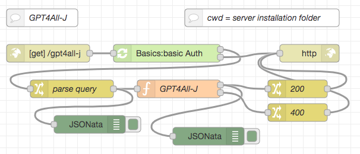
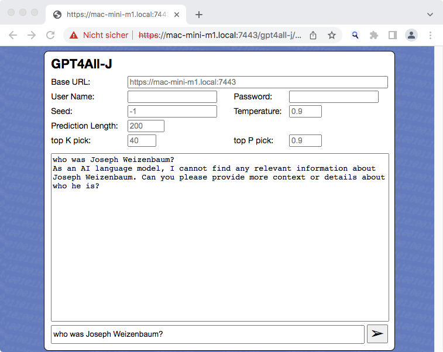

# node-red-flow-gpt4all-j #

Node-RED Flow (and web page example) for the GPT4All-J AI model

This repository contains a function node for [Node-RED](https://nodered.org/) which can be used to run the [GPT4All-J model](https://static.nomic.ai/gpt4all/2023_GPT4All-J_Technical_Report_2.pdf) using the [official GPT4All-J Chat Interface](https://github.com/nomic-ai/gpt4all-chat) within a Node-RED flow. **Inference is done on the CPU** (without requiring any special hardware) and still completes within a few seconds on a reasonably powerful computer.

Having the actual inference as a self-contained function node gives you the possibility to create your own user interface or even use it as part of an autonomous agent.

> Nota bene: these flows do not contain the actual model. You will have to [download your own copy](https://gpt4all.io/models/ggml-gpt4all-j.bin) directly from the link given in the docs for GPT4All-J.

If you like, you may also check out similar nodes and flows for other AI models as there are

* [Meta AI LLaMA](https://github.com/rozek/node-red-flow-llama)
* [Stanford Alpaca, trained with GPT-3](https://github.com/rozek/node-red-flow-alpaca)
* [Stanford Alpaca, trained with GPT-4](https://github.com/rozek/node-red-flow-gpt4-x-alpaca)
* [Nomic AI GPT4All (filtered version)](https://github.com/rozek/node-red-flow-gpt4all-filtered)
* [Nomic AI GPT4All (unfiltered version)](https://github.com/rozek/node-red-flow-gpt4all-unfiltered)
* [Vicuna](https://github.com/rozek/node-red-flow-vicuna)
* [OpenLLaMA](https://github.com/rozek/node-red-flow-openllama)

> Just a small note: if you like this work and plan to use it, consider "starring" this repository (you will find the "Star" button on the top right of this page), so that I know which of my repositories to take most care of.

## Installation ##

Start by creating a subfolder called `.nomic` (mind the leading dot!) within your home directory (on UNIX-like platforms, this folder is accessed using `~/.nomic`). This subfolder will later store the actual model.

Then, create another subfolder called `ai` within the installation folder of your Node-RED server. This subfolder will later store the executable.

### Building the Executable ###

The actual "heavy lifting" is done by the [GPT4All-J Chat Interface](https://github.com/nomic-ai/gpt4all-chat). Simply follow the instructions found in section [Building and running CLI tools only (no Qt required)](https://github.com/nomic-ai/gpt4all-chat#building-and-running-cli-tools-only-no-qt-required) of the docs for the chat interface to build the `chat` executable for your platform.

Afterwards, rename `chat` to `gpt-j` and copy it into the subfolder `ai` you created before.

### Preparing the Model ###

Download the model from the [link given in the docs for GPT4All-J](https://gpt4all.io/models/ggml-gpt4all-j.bin) and copy it into the folder `~/.nomic` you created before.

### Importing the Function Node ###

Finally, open the Flow Editor of your Node-RED server and import the contents of [GPT4All-J-Function.json](./GPT4All-J-Function.json). After deploying your changes, you are ready to run GPT4All-J inferences directly from within Node-RED.

## Usage ##

The prompt itself and any inference parameters have to be passed as properties of the msg object. The prompt is expected in `msg.payload` and will later be replaced by the result of the inference.

The following properties are supported:

* `payload` - this is the actual prompt 
* `seed` - seed value for the internal pseudo random number generator (integer ≧ -1, default: -1)
* `predict` - number of tokens to predict (integer ≧ 1, default: 200)
* `topk` - top-k sampling limit (integer ≧ 1, default: 40)
* `topp` - top-p sampling limit (0.0...1.0, default: 0.9)
* `temperature` - temperature (0.0...1.0, default: 0.9)

All properties (except the prompt itself) are optional. If given, they should be strings (even if they contain numbers), this makes it simpler to extract them from an HTTP request.

## Example ##

The file [GPT4All-J-HTTP-Endpoint.json](./GPT4All-J-HTTP-Endpoint.json) contains an example which uses the GPT4All-J function node to answer HTTP requests. The prompt itself and any inference parameters have to be passed as query parameters, the result of the inference will then be returned in the body of the HTTP response.

> Nota bene: the screenshot from above shows a modified version of this flow including an authentication node from the author's [Node-RED Authorization Examples](https://github.com/rozek/node-red-authorization-examples), the flow in [GPT4All-J-HTTP-Endpoint.json](./GPT4All-J-HTTP-Endpoint.json) comes without any authentication.

The following parameters are supported (most of them will be copied into a `msg` property of the same name):

* `prompt` - will be copied into `msg.payload`
* `seed` - will be copied into `msg.seed`
* `predict` - will be copied into `msg.predict`
* `topk` - will be copied into `msg.topk`
* `topp` - will be copied into `msg.topp`
* `temperature` - will be copied into `msg.temperature`

In order to install this flow, simply open the Flow Editor of your Node-RED server and import the contents of [LLaMA-HTTP-Endpoint.json](./LLaMA-HTTP-Endpoint.json)

### Web Page ###

The file [GPT4All-J.html](./GPT4All-J.html) contains a trivial web page which can act as a user interface for the HTTP endpoint.

Ideally, this page should be served from the same Node-RED server that also accepts the HTTP requests for GPT4All-J, but this is not strictly necessary.

The input fields `Base URL`, `User Name` and `Password` can be used if web server and Node-RED server are at different locations: just enter the base URL of your Node-RED HTTP endpoint (without the trailing `gpt4all-j`) and, if that server requires basic authentication, your user name and your password in the related input fields before you send your first prompt - otherwise, just leave all these fields empty.

The input fields `Seed`, `Temperature`, `Prediction Length`, `top K pick` and `top P pick` may be used to customize some of the parameters described above - if left empty, their "placeholders" show the respective default values.

The largest field will show a transcript of your current dialog with the inference node.

Finally, the bottommost input field may be used to enter a prompt - if one is present, the "Send" button becomes enabled: press it to submit your prompt, then wait for a response.

> Nota bene: **inference is still done on the Node-RED server**, not within your browser!

## License ##

[MIT License](LICENSE.md)
